# Taller Disponibilidad y Desempeño

### Requerimientos


### Problema
El código de este repositorio contiene el algoritmo que permite construir una **matriz Hadamard** de orden 2^n y ofrece una API que atravéz del endpoint **/hadamard/{n}** permite consultar la matriz a travéz de peticiones HTTP GET.
Este problema requiere un alto nivel de procesamiento debido a que el tamaño de la matriz va creciendo exponencialmente.

### Construcción de Solución Autoescalable en AWS
Para crear una solución autoescalable en Amazon Web Services, debemos crear una imagen de la máquina que contendrá nuestro sistema. por lo cual se debe:
1. Crear una instancia EC2 linux  
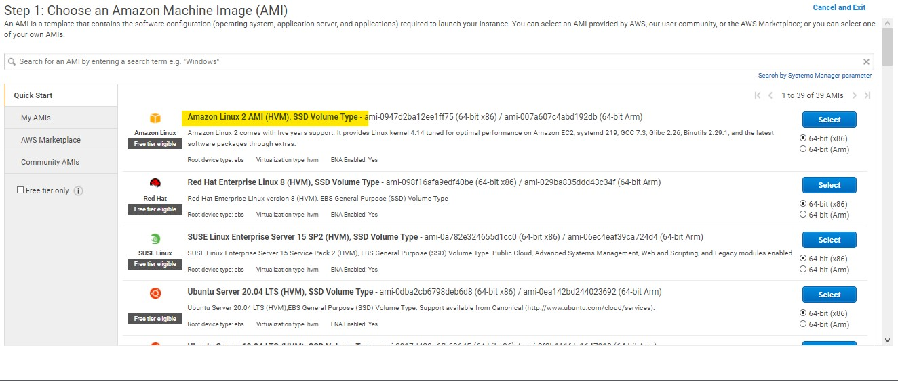
2. Instalar docker y docker-compose en la respectiva máquina. a continuación dejo un tutorial de referencia.
    * [Instalar Docker y docker-compose en EC2](https://gist.github.com/npearce/6f3c7826c7499587f00957fee62f8ee9)
3. Una vez instalado, descargar la imagen de este proyecto desde dockerhub.
    * ``` docker pull andresmarcelo7/hadamardapi```
4. Ejecutar un contenedor que contenga la imagen previamente instalada
    * ```docker run -d -p 8080:6000 --name hadamardapi andresmarcelo7/hadamardapi```
5. A continuación vamos a configurar la instancia para que cada vez que se inicie, empiece a ejecutar nuestro contenedor.
    * Debemos crear un archivo hadamard.service en la ruta **etc/systemd/system**
    * Damos permisos de ejecucion, lectura y escritura con el comando **chmod 777** y añadimos lo siguiente al archivo:
    ```[Unit]
    Description=Hadamard API container  
    Requires=docker.service  
    After=docker.service

    [Service]
    Restart=always  
    ExecStart=/usr/bin/docker start -a hadamardapi 
    ExecStop=/usr/bin/docker stop -t 2 hadamardapi

    [Install]
    WantedBy=default.target
    ```
6. Con esta configuracion nuestra instancia está lista, a continuación crearemos una imagen de esta máquina para crear nuestra solución autoescalable:
    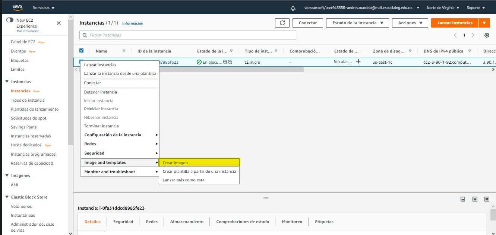
    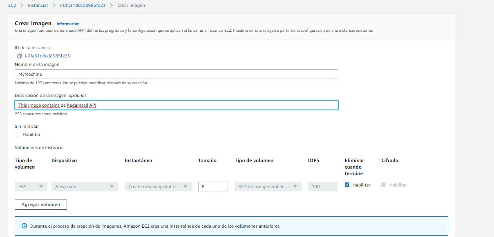

7. Tambien crearemos una plantilla de lanzamiento que nos servira para integrarla en el grupo de autoescalamiento:
    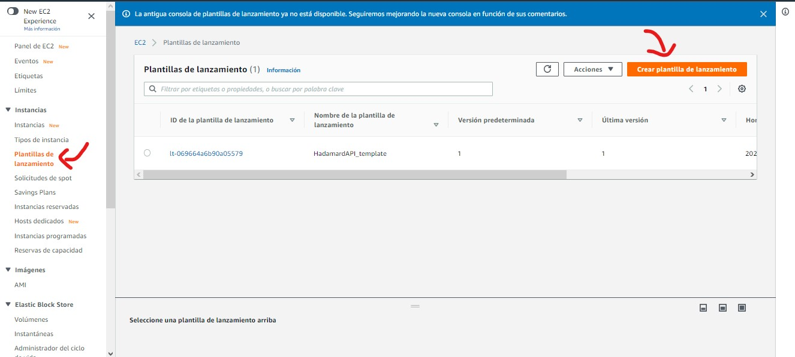
    * Le damos un nombre y una descripcion a nuestra plantilla.
    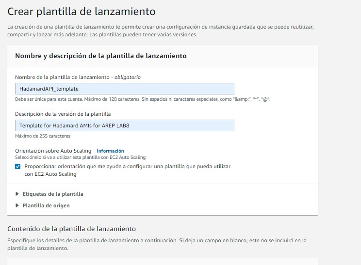
    * Seleccionamos la imagen de la maquina que creamos anteriormente.
    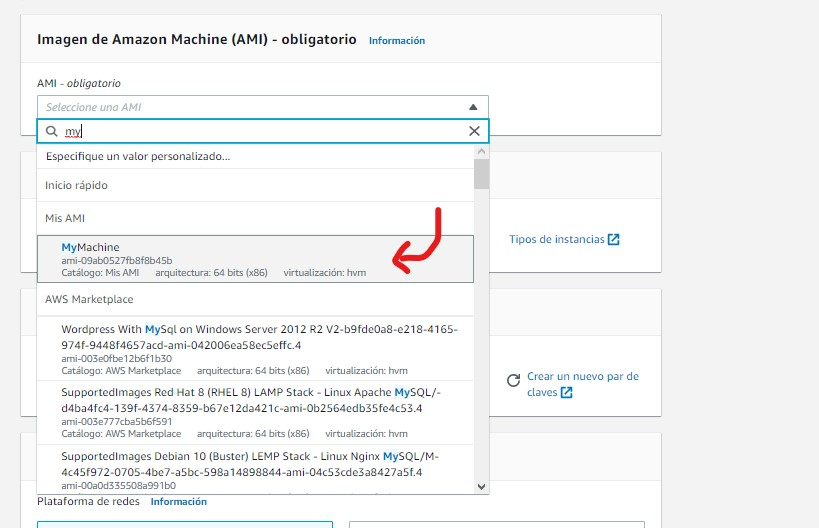
    * Luego seleccionamos el tipo de instancia (t2.micro) y el par de llaves que creamos cuando se generó la instancia.
    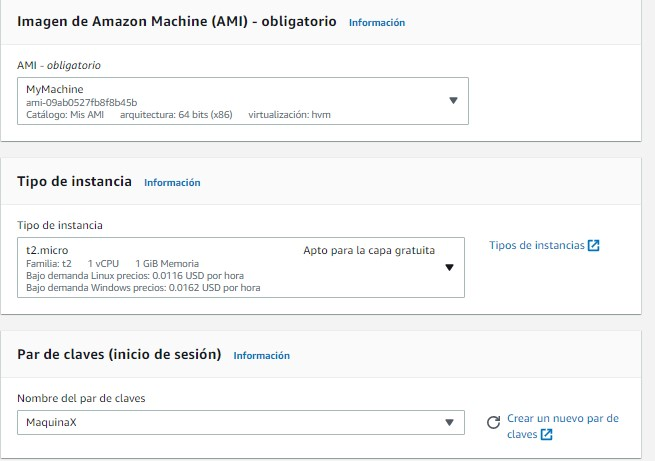
8. Una vez creada nuestra plantilla, iremos a la sección de **grupos de autoescalamiento** de AWS y crearemos una nueva.
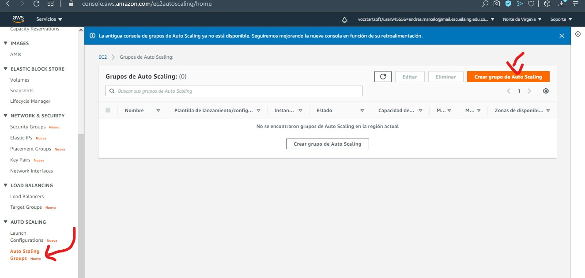
    * Le pondremos un nombre y seleccionaremos la plantilla que creamos anteriormente:
    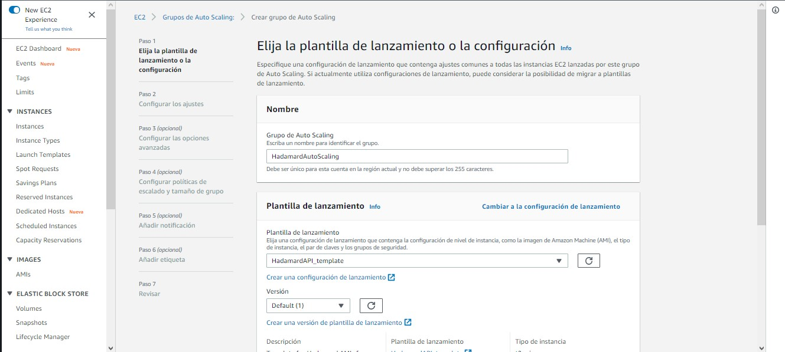
    * Seleccionaremos la opcion de 'Adherirse a la plantilla' y posteriormente adicionaremos algunas de las sub-redes por default que nos ofrece AWS
    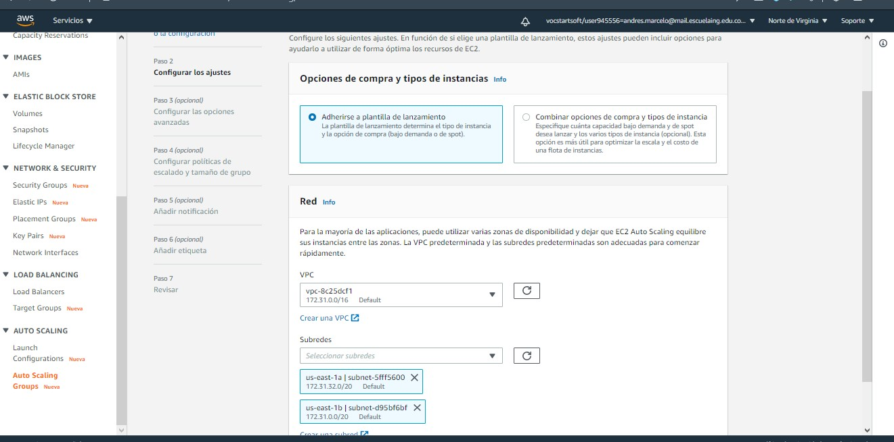
    * A continuación habilitaremos el balance de carga clásico para distribuir las peticiones a las instancias que se vayan creando a medida de que se vaya ocupando nuestra primera máquina.
    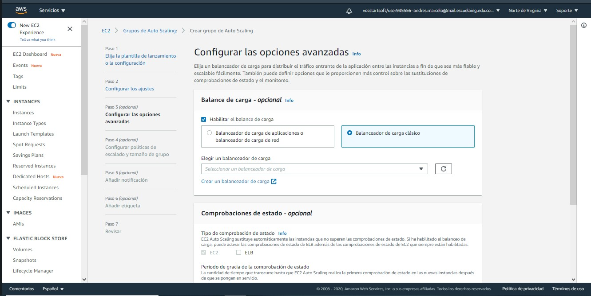
    * Para crear un balanceador de carga iremos a la seccion de balanceadores de carga de Amazon AWS y crearemos un balanceador de carga clásico:
    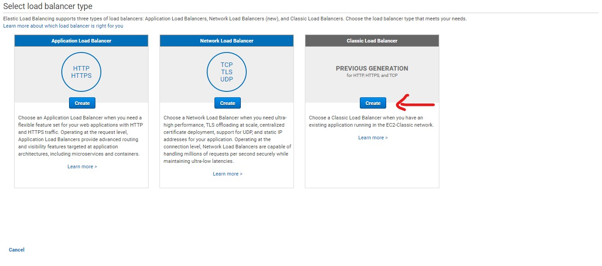
    * Le pondremos nombre y agregaremos las reglas de entrada que prefiramos, en este caso solo permitiremos peticiones a través del puerto 8080 y se conectara con el mismo puerto de la instancia
    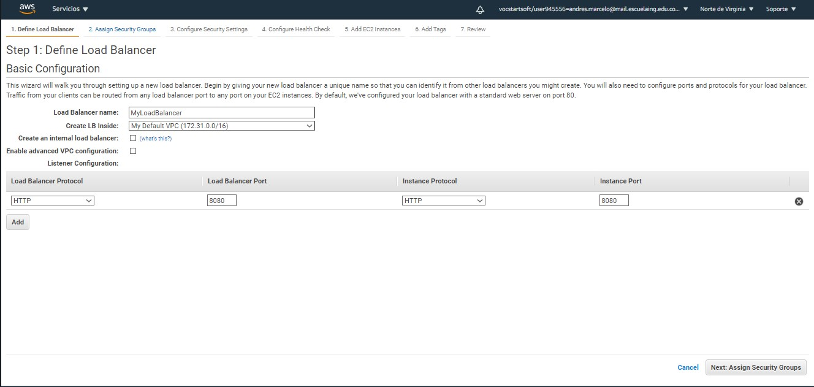
    * Configuraremos el health check del balanceador de carga con ciertas consultas a la API cada cierto tiempo
    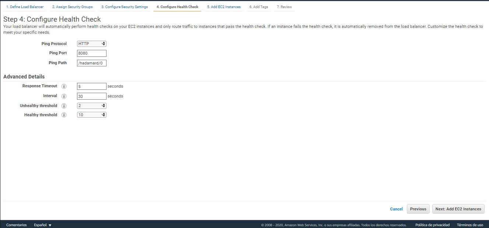
    * Y finalmente **no** agregaremos ninguna maquina a nuestro balanceador de carga, el grupo de autoescalamiento se encargara de ello.
    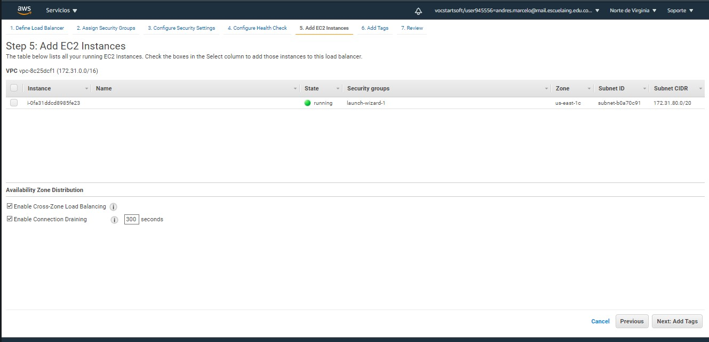
    * Luego de esto, agregaremos nuestro balanceador de carga a las configuraciones del grupo de autoescalamiento y continuaremos con el siguiente paso, **Agregar politicas de escalado y tamaño de grupo** , añadiremos el tope de uso de CPU y segun esto, si se excede se creará otra instancia con las mismas configuraciones de la plantilla.
    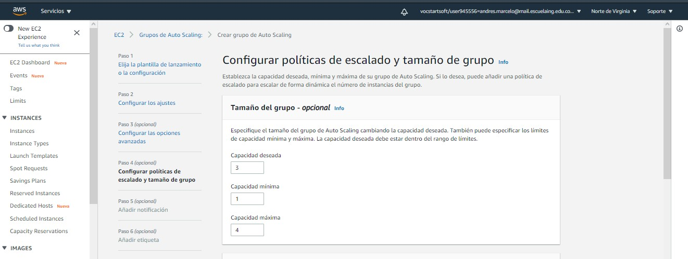
    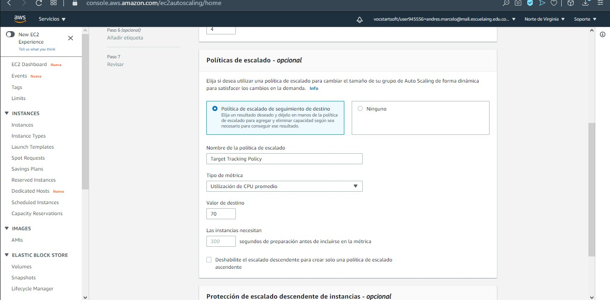
    * Una vez agregadas estas configuraciones, continuaremos con el proceso y crearemos nuestro grupo.
    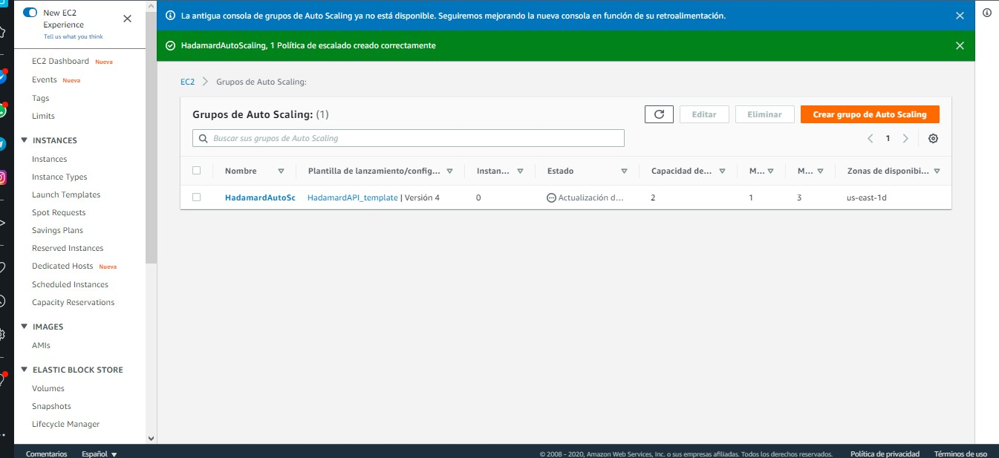
9. Una vez nuestro recurso esta creado, realizaremos concurrentemente diversas peticiones pesadas para el servidor a traves del balanceador de carga que creamos y podremos evidenciar como el balanceador de carga crea recursos a medida de que se cumple la politica de autoescalamiento:
    * Realizamos diversas pruebas a traves de distintas instancias de postman Runner ejecutadas al tiempo al balanceador de carga.
    
    * Esto provoca un uso de cpu que sobrepasa el 80% de nuestra primera maquina.
    
    * En nuestro grupo de autoescalamiento se genera una alerta y se empieza a crear otra instancia.
    
    * Continuamos haciendo peticiones al balanceador de carga para ocupar mas procesamiento de las maquinas y generar nuevas a tal punto que nuestro grupo de autoescalamiento **generan** nuevas maquinas y cuando se acaben las peticiones se **eliminan** las instancias creadas como se ve a continuación.
    

### Demostración

En el siguiente [enlace](https://youtu.be/3iv3y0Q2RqA) encontrarás un video en donde se ve este grupo de autoescalamiento en ejecución y las pruebas que se le hicieron 
    
    
## Autor

* **Andrés Felipe Marcelo** - [AndresMarcelo7](https://github.com/AndresMarcelo7)

## Licencia

Este proyecto esta licenciado bajo GNU v3.0 License - Mira [LICENSE](LICENSE) para mas detalles.
